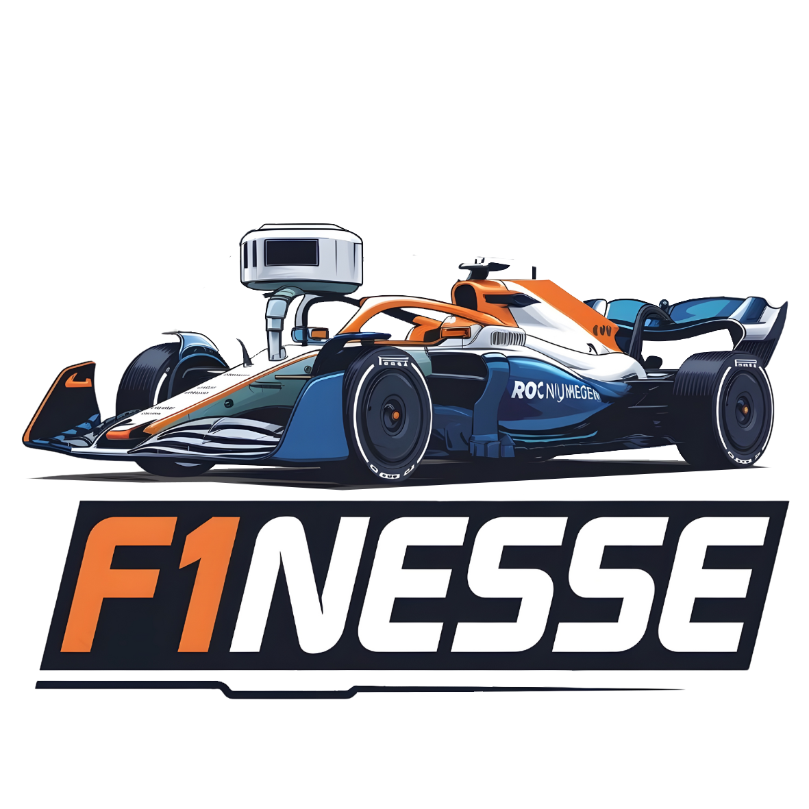

# F1NESSE
Formula 1 Neuro-Enhanced System for Smart Execution

  

## Table of Contents
- [Acknowledgments](#acknowledgments)

---

---

### Acknowledgments
This project is developed by [Jannus-dev](https://github.com/Jannus-dev) and [Joris Krantz](https://github.com/Deedikjupijn) and is part of research initiatives from the **Donders Centre for Cognition, Radboud University**, **Cavaa (Counterfactual Assessment and Valuation for Awareness Architecture)**, and **ROC Nijmegen**.

For more details, visit:
- [Donders Centre for Cognition](https://www.ru.nl/donders/)
- [Radboud University](https://www.ru.nl/english/)
- [Cavaa](https://cavaa.eu/)
- [ROC Nijmegen](https://www.roc-nijmegen.nl/)
  

  
  
  
  

Special thanks to the RoboRacers community for their contributions.
 

---
For more information, visit the [RoboRacers website](https://roboracers.org).

